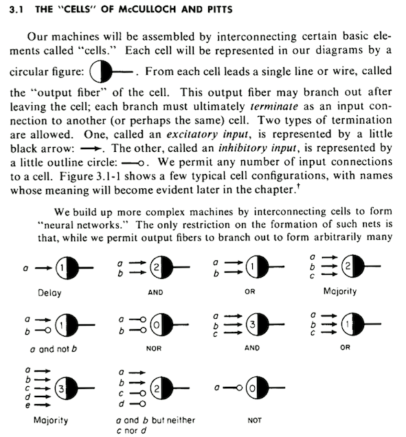
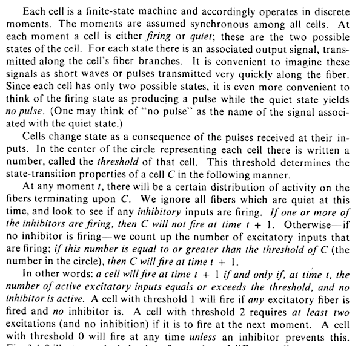

# [neural-nets-sim](https://justinmeiners.github.io/neural-nets-sim)

Created by: [Ryan Pendleton](https://github.com/rpendleton) & [Justin Meiners](https://github.com/justinmeiners)





Pages from [Computation: finite and infinite machines](https://dl.acm.org/citation.cfm?id=1095587) by Marvin Minsky.

# License

This code is licensed under [GPL v3.0](LICENSE).

# Neural Net List

This is a list where you can contribute your own neural nets. Simply host them some place that is publically accessible (Like a Gist) and add a link to it:

```
https://justinmeiners.github.io/neural-nets-sim/?d=https://yourlinkhere
```

- [Gist Sample](https://justinmeiners.github.io/neural-nets-sim/?d=https://gist.githubusercontent.com/justinmeiners/8f02ad348f577eb0fc29d64fccde94a3/raw/b1804996b41ab811c1976dde77f9af2dbf86bbbf/sample_net.net) Shows you how to host a Neural Net in a Gist. By [justinmeiners](https://github.com/justinmeiners).
